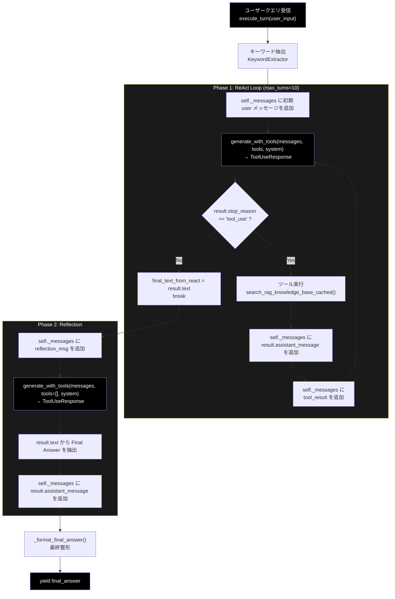
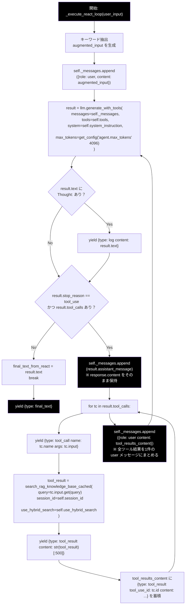
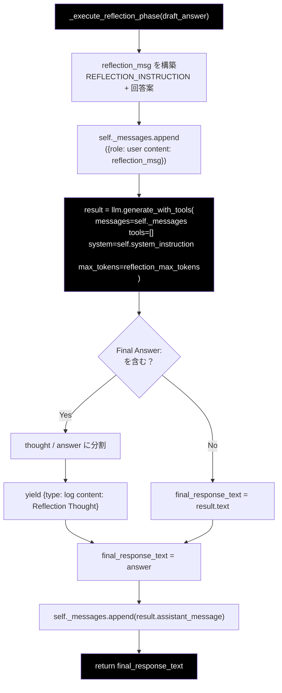
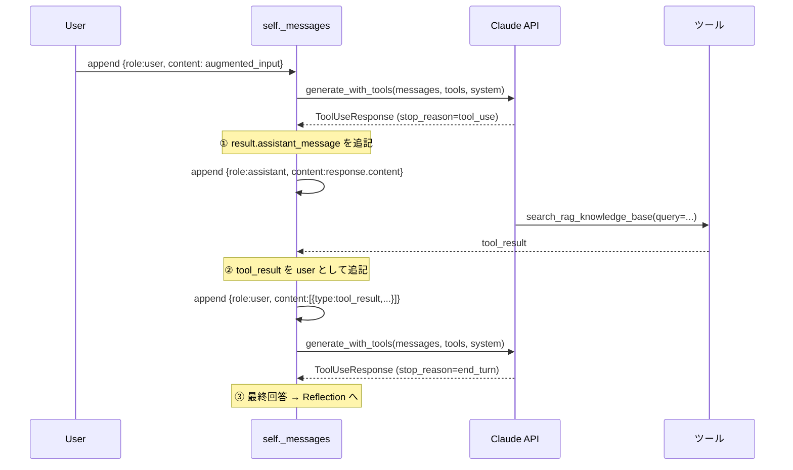
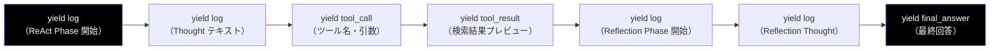

# ReAct + Reflection パターン 仕様書

**対象ファイル**: `services/agent_service.py`  
**LLMバックエンド**: Anthropic Claude API（`helper/helper_llm.py` の `AnthropicClient` 経由）  
**最終更新**: 2026-04-28

---

## 目次

1. [ReAct パターン概要](#1-react-パターン概要)
2. [全体構成](#2-全体構成)
3. [ReAct ループ詳細フロー](#3-react-ループ詳細フロー)
4. [Anthropic Tool Use フォーマット仕様](#4-anthropic-tool-use-フォーマット仕様)
5. [ToolUseResponse（戻り値型）](#5-toolusereposense戻り値型)
6. [generate_with_tools() 仕様](#6-generate_with_tools-仕様)
7. [Reflection フェーズ詳細](#7-reflection-フェーズ詳細)
8. [会話履歴管理（self._messages）](#8-会話履歴管理self_messages)
9. [変更不要なコンポーネント](#9-変更不要なコンポーネント)
10. [実装コード対応表](#10-実装コード対応表)
11. [イベントストリーム設計](#11-イベントストリーム設計)
12. [エラーハンドリング方針](#12-エラーハンドリング方針)
13. [実装チェックリスト](#13-実装チェックリスト)
14. [付録: 完全な疑似コード](#14-付録-完全な疑似コード)

---

## 1. ReAct パターン概要

**ReAct（Reasoning + Acting）** とは、LLM が「思考 → 行動 → 観察」を繰り返して問題を解くパターンです。

```
Thought     : なぜ検索が必要か、どんなクエリで検索するか
Action      : ツール（RAG検索 など）を呼び出す
Observation : ツールの実行結果を受け取る
   ↓ 必要に応じて繰り返す
Final Answer : 最終回答を返す
```

`agent_service.py` ではこれに加えて **Reflection（自己評価・推敲）** フェーズを持ち、
ReAct ループが生成した回答案をさらに LLM が客観的に評価・修正する **2段構成** になっています。

```
Phase 1: ReAct Loop   — 思考・検索・観察 を最大 max_turns 回繰り返し、回答案を生成
Phase 2: Reflection   — 回答案を自己評価・修正して Final Answer を出力
```

---

## 2. 全体構成



**設計上の重要ポイント:**

- `self._messages` はターン開始時（`execute_turn()` の先頭）にリセットされる
- `generate_with_tools()` は `ToolUseResponse`（NamedTuple）を返す
- `result.assistant_message` には `response.content` がそのまま保持されており、呼び出し側での再構築は不要
- Reflection も `generate_with_tools(tools=[])` で実行し、会話コンテキスト（ReAct ループの検索結果・思考ログ）を完全に引き継ぐ

---

## 3. ReAct ループ詳細フロー



**ツール結果の messages 追記パターン（ターンあたり）:**

```
self._messages の構造（1ターンのツール呼び出し後）:

[
  {"role": "user",      "content": "augmented_input"},
  {"role": "assistant", "content": [TextBlock, ToolUseBlock]},   ← result.assistant_message
  {"role": "user",      "content": [                             ← tool_results_content
      {"type": "tool_result", "tool_use_id": "toolu_xxx", "content": "..."},
      {"type": "tool_result", "tool_use_id": "toolu_yyy", "content": "..."},
  ]},
  ...  次のターンの assistant / user が続く
]
```

---

## 4. Anthropic Tool Use フォーマット仕様

### 4-1. ツール定義（`_build_tools()` が生成）

```python
tools = [
    {
        "name"        : "search_rag_knowledge_base",
        "description" : "社内ドキュメント（Qdrant）から関連情報をベクトル検索する。...",
        "input_schema": {
            "type"      : "object",
            "properties": {
                "query": {
                    "type"       : "string",
                    "description": "検索クエリ。固有名詞・専門用語は原文のまま含めること。"
                }
            },
            "required": ["query"]
        }
    },
    {
        "name"        : "list_rag_collections",
        "description" : "利用可能な Qdrant コレクションの一覧を取得する。",
        "input_schema": {"type": "object", "properties": {}, "required": []}
    }
]
```

| キー | 説明 |
|------|------|
| `name` | ツール識別名（LLM が呼び出し時に指定） |
| `description` | ツールの用途説明（LLM がツール選択の判断に使用） |
| `input_schema` | JSON Schema 形式のパラメータ定義（`"parameters"` キーは使用しない） |

### 4-2. ツール呼び出し検出

`generate_with_tools()` 内部での検出ロジック：

```python
if response.stop_reason == "tool_use":          # ツール呼び出しの合図
    for b in response.content:
        if b.type == "tool_use":
            tool_name = b.name
            tool_args = b.input                  # dict 形式
            tool_id   = b.id                     # "toolu_..." 形式
```

> **`tool_id` の重要性**: ツール結果を返す際に `tool_use_id` として必ず一致させる必要があります。複数ツールが同時に呼び出された場合も、それぞれの `id` に対応する `tool_result` を返す必要があります。

### 4-3. ツール結果の返送

ツール結果を返す前に **必ず assistant ターンを履歴に保存**する必要があります。

```
① assistant ターンを保存（result.assistant_message を使用）
② tool_result を user ターンとして追記
③ 更新済み messages で generate_with_tools() を再呼び出し
```

```python
# ① assistant ターンを保存
self._messages.append(result.assistant_message)

# ② 全ツール結果を1件の user メッセージにまとめて追記
self._messages.append({
    "role"   : "user",
    "content": [
        {
            "type"       : "tool_result",
            "tool_use_id": tc["id"],
            "content"    : str(tool_result)
        }
        for tc in result.tool_calls
    ]
})

# ③ 更新済み self._messages で次のターンを呼び出し（ループ先頭に戻る）
```

---

## 5. ToolUseResponse（戻り値型）

`generate_with_tools()` の戻り値は `ToolUseResponse`（NamedTuple）です。
`helper/helper_llm.py` で定義されています。

```python
class ToolUseResponse(NamedTuple):
    text: str               # テキスト応答（複数 text ブロックは空白結合済み）
    tool_calls: List[Dict]  # [{"name":..., "input":..., "id":...}, ...]
    stop_reason: str        # "tool_use" | "end_turn" | "max_tokens" | "stop_sequence"
    assistant_message: Dict # {"role":"assistant","content": response.content}
```

### フィールド詳細

| フィールド | 型 | 説明 |
|-----------|-----|------|
| `text` | `str` | LLM のテキスト応答。ツール呼び出しのみのターンでは空文字列になることがある |
| `tool_calls` | `List[Dict]` | ツール呼び出しリスト。各要素は `{"name", "input", "id"}` を持つ |
| `stop_reason` | `str` | API の停止理由。ループ継続判定に使用 |
| `assistant_message` | `Dict` | `response.content` をそのまま保持した assistant ターン。呼び出し側での再構築は不要 |

### `stop_reason` の判定ロジック

| 値 | 意味 | ReAct ループの動作 |
|---|------|-----------------|
| `"tool_use"` | ツール呼び出しあり | ツール実行 → messages 追記 → ループ継続 |
| `"end_turn"` | 通常終了 | `result.text` を最終回答として break |
| `"max_tokens"` | トークン上限 | `result.text` を最終回答として break |
| `"stop_sequence"` | ストップシーケンス | `result.text` を最終回答として break |

### `assistant_message` が重要な理由

`response.content` は `[TextBlock, ToolUseBlock, ...]` のように **複数種類のブロックが混在し順序を持ちます**。`assistant_message` はこれをそのまま保持するため、ブロック順序・構造が完全に維持されます。

```python
# NG: text と tool_calls から手動再構築（順序・構造が保証されない）
assistant_content = []
if text:
    assistant_content.append({"type": "text", "text": text})
for tc in tool_calls:
    assistant_content.append({"type": "tool_use", ...})

# OK: result.assistant_message をそのまま使用（順序・構造完全保持）
self._messages.append(result.assistant_message)
```

### 使用例

```python
result: ToolUseResponse = self.llm.generate_with_tools(messages, tools, system)

# 名前付きアクセス（推奨）
if result.stop_reason != "tool_use" or not result.tool_calls:
    final_text = result.text
    break

self._messages.append(result.assistant_message)   # 再構築不要

for tc in result.tool_calls:
    tool_result = execute_tool(tc["name"], tc["input"])
    # tc["id"] を tool_use_id として使用
```

---

## 6. `generate_with_tools()` 仕様

`helper/helper_llm.py` の `AnthropicClient` に実装されているメソッドです。
ReAct ループの **1ステップ分の API 呼び出し・ツール呼び出し抽出・テキスト抽出** を担います。

### シグネチャ

```python
def generate_with_tools(
    self,
    messages  : List[Dict[str, Any]],
    tools     : List[Dict[str, Any]],
    system    : str = "",
    model     : Optional[str] = None,
    max_tokens: int = 4096,
) -> ToolUseResponse:
```

### パラメータ

| パラメータ | 型 | 説明 |
|-----------|-----|------|
| `messages` | `List[Dict]` | 会話履歴（Anthropic messages 形式）。`self._messages` をそのまま渡す |
| `tools` | `List[Dict]` | ツール定義リスト。Reflection フェーズなどツール不要時は `[]` を渡す |
| `system` | `str` | システムプロンプト。`self.system_instruction` を渡す |
| `model` | `Optional[str]` | 使用モデル（省略時は `default_model`） |
| `max_tokens` | `int` | 最大出力トークン数（デフォルト: 4096） |

### 内部処理

```python
response = self.client.messages.create(
    model=model_name, max_tokens=max_tokens,
    tools=tools, messages=messages, system=system
)

tool_calls = [
    {"name": b.name, "input": b.input, "id": b.id}
    for b in response.content if b.type == "tool_use"
]

text = " ".join(b.text for b in response.content if b.type == "text")

assistant_message = {"role": "assistant", "content": response.content}

return ToolUseResponse(
    text=text,
    tool_calls=tool_calls,
    stop_reason=response.stop_reason,
    assistant_message=assistant_message,
)
```

### Reflection フェーズでの使用（`tools=[]`）

```python
result = self.llm.generate_with_tools(
    messages   = self._messages,    # ReAct ループの会話コンテキストを引き継ぐ
    tools      = [],                # Tool Use なし
    system     = self.system_instruction,
    model      = self.model_name,
    max_tokens = get_config("agent.reflection_max_tokens", 2048),
)
reflection_text = result.text
self._messages.append(result.assistant_message)
```

> **なぜ `generate_content()` ではなく `generate_with_tools(tools=[])` を使うか**
> `generate_content()` はシングルターン呼び出しのため `self._messages` の会話履歴が引き継がれません。`generate_with_tools(tools=[])` を使うことで `self._messages` を全件渡し、会話コンテキストを完全に維持します。

### `build_tool_result_message()` ユーティリティ

`AnthropicClient`（`helper/helper_llm.py`）に実装されているヘルパーメソッドです。複数ツールが同時に呼び出された際に、全結果を1件の user メッセージ形式にまとめます。

```python
def build_tool_result_message(
    self,
    tool_calls: List[Dict[str, Any]],
    results   : List[str],
) -> Dict[str, Any]:
    """
    Args:
        tool_calls : generate_with_tools() の tool_calls（id を含む）
        results    : 各ツールの実行結果文字列（tool_calls と同順）

    Returns:
        {"role": "user", "content": [{"type": "tool_result", ...}, ...]}
    """
    content = [
        {
            "type"       : "tool_result",
            "tool_use_id": tc["id"],
            "content"    : result,
        }
        for tc, result in zip(tool_calls, results)
    ]
    return {"role": "user", "content": content}
```

**使用例（エラーハンドリングと組み合わせ）:**

```python
results = []
for tc in result.tool_calls:
    try:
        tool_result = execute_tool(tc["name"], tc["input"])
    except RAGToolError as e:
        tool_result = f"エラーが発生しました: {str(e)}"
    results.append(str(tool_result))

self._messages.append(result.assistant_message)
self._messages.append(self.llm.build_tool_result_message(result.tool_calls, results))
```

> **注**: `agent_service.py` では tool_results_content を直接構築していますが、`build_tool_result_message()` を使うとより簡潔に記述できます。

---

## 7. Reflection フェーズ詳細



### Reflection の出力フォーマット

LLM は `REFLECTION_INSTRUCTION` に従い以下の形式で応答します：

```
Thought: [評価と修正の思考プロセス]
Final Answer: [最終的な回答]
```

`_execute_reflection_phase()` は `"Final Answer:"` で分割し、後半を最終回答として採用します。

### エラー処理

Reflection フェーズで例外が発生した場合、`draft_answer`（ReAct ループの最終テキスト）をそのまま返してフォールバックします。

---

## 8. 会話履歴管理（`self._messages`）

### ライフサイクル

```python
def execute_turn(self, user_input: str):
    self._messages = []     # ① ターン開始時にリセット（ステートレス設計）
    # ② _execute_react_loop() 内で追記
    # ③ _execute_reflection_phase() 内でさらに追記
    # ④ ターン終了時に破棄（次のターンで ① に戻る）
```

### messages の完全な構造例

```
# --- ReAct Phase ---
{role: "user",      content: "augmented_input (+ キーワード)"}     ← 初期
{role: "assistant", content: [TextBlock("Thought..."), ToolUseBlock("search...")]}  ← result.assistant_message
{role: "user",      content: [{type:"tool_result", tool_use_id:"toolu_001", content:"..."}]}
{role: "assistant", content: [TextBlock("Answer:...")]}            ← ツール不要ターンの応答

# --- Reflection Phase ---
{role: "user",      content: "REFLECTION_INSTRUCTION + 回答案"}
{role: "assistant", content: [TextBlock("Thought:...\nFinal Answer:...")]}  ← result.assistant_message
```

### `assistant_message` に `response.content` をそのまま使う理由

Anthropic API は `assistant` ロールの `content` として SDK の `ContentBlock` リストを受け付けます。手動再構築した場合はブロックの順序が変わる可能性があり、API がエラーを返すリスクがあります。`result.assistant_message` はこれをそのまま保持しており、完全な整合性が保証されます。

### messages の時系列（シーケンス図）



### messages の完全な具体例（1回の検索 → 最終回答）

```python
messages = [
    # ① 初期ユーザー入力（キーワード付き）
    {
        "role"   : "user",
        "content": "カリン・フォン・アロルディンゲンについて教えて\n\n【重要キーワード】カリン・フォン・アロルディンゲン"
    },

    # ② LLM の応答（Tool Use を含む） ← result.assistant_message
    {
        "role"   : "assistant",
        "content": [
            {
                "type": "text",
                "text": "Thought: 社内ナレッジを検索します。"
            },
            {
                "type" : "tool_use",
                "id"   : "toolu_01XxYy",
                "name" : "search_rag_knowledge_base",
                "input": {"query": "カリン・フォン・アロルディンゲン"}
            }
        ]
    },

    # ③ ツール実行結果（user として送信）
    {
        "role"   : "user",
        "content": [
            {
                "type"       : "tool_result",
                "tool_use_id": "toolu_01XxYy",       # ② の id と必ず一致させる
                "content"    : "【検索結果】カリン・フォン・アロルディンゲン (1941-) はドイツの..."
            }
        ]
    },

    # ④ LLM の最終応答（stop_reason=end_turn）← result.assistant_message
    {
        "role"   : "assistant",
        "content": [
            {
                "type": "text",
                "text": "Thought: 検索結果から回答します。\nAnswer: カリン・フォン・アロルディンゲンは..."
            }
        ]
    },

    # ⑤ Reflection 用プロンプト
    {
        "role"   : "user",
        "content": "## Reflection\n...\n**あなたの回答案:**\nカリン・フォン・アロルディンゲンは..."
    },

    # ⑥ Reflection 応答 ← result.assistant_message
    {
        "role"   : "assistant",
        "content": [
            {
                "type": "text",
                "text": "Thought: 回答を確認します。\nFinal Answer: カリン・フォン・アロルディンゲンは..."
            }
        ]
    }
]
```

---

## 9. 変更不要なコンポーネント

以下は LLM プロバイダーに依存せず、変更不要です。

| コンポーネント | 所在 | 説明 |
|-------------|------|------|
| `SYSTEM_INSTRUCTION_TEMPLATE` | `agent_service.py` | プロンプト文字列 |
| `REFLECTION_INSTRUCTION` | `agent_service.py` | Reflection 用プロンプト |
| `KeywordExtractor` | `regex_mecab.py` | キーワード抽出ロジック |
| `search_rag_knowledge_base_cached()` | `agent_tools.py` | RAG検索ロジック |
| `log_unanswered_question()` | `services/log_service.py` | 未回答ログ記録 |
| `_format_final_answer()` | `agent_service.py` | 最終回答整形 |
| `get_available_collections_from_qdrant_helper()` | `agent_service.py` | コレクション取得 |

---

## 10. 実装コード対応表

| 機能 | クラス/メソッド | 所在 |
|------|--------------|------|
| エージェント本体 | `ReActAgent` | `services/agent_service.py` |
| ターン実行（エントリポイント） | `ReActAgent.execute_turn()` | `services/agent_service.py` |
| ReAct ループ | `ReActAgent._execute_react_loop()` | `services/agent_service.py` |
| Reflection フェーズ | `ReActAgent._execute_reflection_phase()` | `services/agent_service.py` |
| システムプロンプト構築 | `ReActAgent._build_system_instruction()` | `services/agent_service.py` |
| ツール定義構築 | `ReActAgent._build_tools()` | `services/agent_service.py` |
| 最終回答整形 | `ReActAgent._format_final_answer()` | `services/agent_service.py` |
| LLM Tool Use 呼び出し | `AnthropicClient.generate_with_tools()` | `helper/helper_llm.py` |
| 戻り値型定義 | `ToolUseResponse` (NamedTuple) | `helper/helper_llm.py` |
| ツール実装（RAG検索） | `search_rag_knowledge_base_cached()` | `agent_tools.py` |
| コレクション取得 | `get_available_collections_from_qdrant_helper()` | `services/agent_service.py` |

---

## 11. イベントストリーム設計

`execute_turn()` は `Generator` として実装し、処理の進捗を Streamlit UI にリアルタイム配信します。



| イベント `type` | `content` の内容 | 送信タイミング |
|---------------|----------------|-------------|
| `"log"` | 思考ログ・フェーズ説明テキスト | Thought テキスト検出時 / フェーズ切り替え時 |
| `"tool_call"` | `{"name": ..., "args": ...}` | ツール呼び出し検出時 |
| `"tool_result"` | 実行結果（先頭 500 文字） | ツール実行直後 |
| `"final_text"` | ReAct ループの最終テキスト | `stop_reason != "tool_use"` 時 |
| `"final_answer"` | Reflection 後の最終回答 | Reflection 完了後 |

### イベント取得例（呼び出し側）

```python
agent = ReActAgent(selected_collections=collections, model_name="claude-sonnet-4-6")

for event in agent.execute_turn(user_input):
    if event["type"] == "log":
        st.write(event["content"])           # 思考ログ表示
    elif event["type"] == "tool_call":
        st.write(f"🔍 検索: {event['args']}")
    elif event["type"] == "tool_result":
        st.write(f"📄 結果: {event['content'][:200]}...")
    elif event["type"] == "final_answer":
        st.write(f"✅ 回答:\n{event['content']}")
```

---

## 12. エラーハンドリング方針

### ツール実行エラー

ツール実行がエラーになっても処理を中断せず、エラーメッセージをツール結果として LLM に返します。LLM 自身がリカバリー戦略（別クエリで再検索、または既知情報で回答）を判断できます。

```python
try:
    if tool_name == "search_rag_knowledge_base":
        tool_result = search_rag_knowledge_base_cached(
            query=tool_args.get("query", ""),
            session_id=self.session_id,
            use_hybrid_search=self.use_hybrid_search,
        )
    else:
        tool_result = TOOLS_MAP[tool_name](**tool_args)
except RAGToolError as e:
    tool_result = f"エラーが発生しました: {str(e)}"
    logger.error(f"RAG Tool Error during '{tool_name}': {e}")
except Exception as e:
    tool_result = f"予期せぬエラー: {str(e)}"
    logger.error(f"Unexpected error during '{tool_name}': {e}", exc_info=True)

# エラーであっても tool_result として LLM に返す
tool_results_content.append({
    "type"       : "tool_result",
    "tool_use_id": tool_id,
    "content"    : str(tool_result),
})
```

### RAG 検索結果なし

`search_rag_knowledge_base_cached()` は結果なし時に特定のプレフィックスを持つ文字列を返します。これを検出して未回答ログを記録します。

```python
if isinstance(tool_result, str) and tool_result.startswith("[[NO_RAG_RESULT"):
    reason = "LOW_SCORE" if "LOW_SCORE" in tool_result else "NO_RESULT"
    log_unanswered_question(
        query=user_input,
        collections=[tool_args.get("collection_name", "unknown")],
        reason=reason,
        agent_response="(Search Failed)"
    )
```

| パターン | 意味 |
|---------|------|
| `[[NO_RAG_RESULT]]` | 検索結果なし |
| `[[NO_RAG_RESULT_LOW_SCORE]]` | スコア閾値未満 |
| `[[RAG_TOOL_ERROR]]` | 検索エラー |

### Reflection フェーズエラー

Reflection で例外が発生した場合、`draft_answer`（ReAct ループの最終テキスト）をそのまま使用してフォールバックします。最終回答が失われることはありません。

```python
try:
    result = self.llm.generate_with_tools(...)
    ...
except Exception as e:
    logger.error(f"Error during reflection phase: {e}")
    yield {"type": "log", "content": f"⚠️ Reflection Error: {e}"}
    final_response_text = draft_answer    # フォールバック
```

---

## 13. 実装チェックリスト

実装・レビュー時に確認すべき項目です。

### 初期化

- [ ] `from helper.helper_llm import create_llm_client, ToolUseResponse` でインポート済み
- [ ] `self.llm = create_llm_client("anthropic", default_model=...)` で初期化済み
- [ ] ツール定義が `"input_schema"` キーを使用している（`"parameters"` キーは使用しない）
- [ ] `self._messages` がターン開始時（`execute_turn()` 先頭）にリセットされている

### ReAct ループ

- [ ] `self._messages.append({"role": "user", "content": augmented_input})` で初期化している
- [ ] `result: ToolUseResponse = self.llm.generate_with_tools(...)` で ToolUseResponse を受け取っている
- [ ] `result.stop_reason != "tool_use"` または `not result.tool_calls` でループ終了を判定している
- [ ] `self._messages.append(result.assistant_message)` で assistant ターンを追記している（手動再構築していない）
- [ ] `tool_use_id` に `tc["id"]` を正しく設定している
- [ ] 複数ツール同時呼び出し時に全 `tool_result` を **同一 user メッセージ内** にまとめている
- [ ] `max_turns` 超過時のガード処理がある

### Reflection フェーズ

- [ ] `generate_with_tools(tools=[])` を使用している（`generate_content()` は使用しない）
- [ ] `self._messages` に reflection_msg を追記した後に `generate_with_tools()` を呼んでいる
- [ ] `result.assistant_message` を `self._messages` に追記している
- [ ] Reflection 失敗時に `draft_answer` へフォールバックしている

### system プロンプト

- [ ] `system=` パラメータで毎回渡している（`messages` リスト内には含めない）
- [ ] `SYSTEM_INSTRUCTION_TEMPLATE.format(available_collections=...)` で動的に生成している

---

## 14. 付録: 完全な疑似コード

### `execute_turn()` — エントリポイント

```python
def execute_turn(self, user_input: str) -> Generator[Dict, None, None]:
    self.thought_log = []
    self._messages   = []     # ターン開始時にリセット

    # Phase 1: ReAct Loop
    yield {"type": "log", "content": "🤖 ReAct Phase Start"}
    draft_answer = None
    for event in self._execute_react_loop(user_input):
        yield event
        if event["type"] == "final_text":
            draft_answer = event["content"]

    # Phase 2: Reflection
    if draft_answer:
        yield {"type": "log", "content": "🔄 Reflection Phase (推敲)"}
        draft_answer = yield from self._execute_reflection_phase(draft_answer)

    yield {"type": "final_answer", "content": self._format_final_answer(draft_answer)}
```

### `_execute_react_loop()` — ReAct ループ本体

```python
def _execute_react_loop(self, user_input: str) -> Generator[Dict, None, None]:

    # キーワード抽出によるプロンプト拡張
    augmented_input = user_input
    if self.keyword_extractor:
        keywords = self.keyword_extractor.extract(user_input, top_n=5)
        if keywords:
            augmented_input = f"{user_input}\n\n重要キーワード: {', '.join(keywords)}"
            yield {"type": "log", "content": f"🔑 Extracted Keywords: {', '.join(keywords)}"}

    # 初期 user メッセージを追加
    self._messages.append({"role": "user", "content": augmented_input})

    max_turns             = get_config("agent.max_turns", 10)
    final_text_from_react = ""

    for turn_count in range(1, max_turns + 1):

        # 1ステップ実行 → ToolUseResponse
        result: ToolUseResponse = self.llm.generate_with_tools(
            messages   = self._messages,
            tools      = self.tools,
            system     = self.system_instruction,
            max_tokens = get_config("agent.max_tokens", 4096),
        )

        # Thought ログ出力
        if result.text and ("Thought:" in result.text or "考え:" in result.text):
            yield {"type": "log", "content": f"🧠 Thought:\n{result.text}"}

        # ツール呼び出しなし → 最終回答
        if result.stop_reason != "tool_use" or not result.tool_calls:
            final_text_from_react = result.text
            break

        # assistant ターンを履歴に追記（response.content をそのまま保持）
        self._messages.append(result.assistant_message)

        # 全ツールを実行し、結果を蓄積
        tool_results_content: List[Dict] = []
        for tc in result.tool_calls:
            yield {"type": "tool_call", "name": tc["name"], "args": tc["input"]}

            try:
                tool_result = search_rag_knowledge_base_cached(
                    query             = tc["input"].get("query", ""),
                    session_id        = self.session_id,
                    use_hybrid_search = self.use_hybrid_search,
                )
            except Exception as e:
                tool_result = f"エラー: {e}"

            yield {"type": "tool_result", "content": str(tool_result)[:500]}

            # tool_use_id は tc["id"] と必ず一致させる
            tool_results_content.append({
                "type"       : "tool_result",
                "tool_use_id": tc["id"],
                "content"    : str(tool_result),
            })

        # 全ツール結果を1件の user メッセージとして追記
        self._messages.append({"role": "user", "content": tool_results_content})

    yield {"type": "final_text", "content": final_text_from_react}
```

### `_execute_reflection_phase()` — Reflection フェーズ

```python
def _execute_reflection_phase(self, draft_answer: str) -> Generator[Dict, None, str]:
    final_response_text = draft_answer
    try:
        reflection_msg = f"{REFLECTION_INSTRUCTION}\n\n**あなたの回答案:**\n{draft_answer}"
        self._messages.append({"role": "user", "content": reflection_msg})

        # tools=[] でツールなし呼び出し（ReAct の会話コンテキストを引き継ぐ）
        result: ToolUseResponse = self.llm.generate_with_tools(
            messages   = self._messages,
            tools      = [],
            system     = self.system_instruction,
            model      = self.model_name,
            max_tokens = get_config("agent.reflection_max_tokens", 2048),
        )

        reflection_text = result.text

        if "Final Answer:" in reflection_text:
            thought, answer = reflection_text.split("Final Answer:", 1)
            yield {"type": "log", "content": f"🤔 Reflection Thought:\n{thought.strip()}"}
            final_response_text = answer.strip()
        else:
            final_response_text = reflection_text

        # Reflection 応答を会話履歴に追記
        self._messages.append(result.assistant_message)

    except Exception as e:
        yield {"type": "log", "content": f"⚠️ Reflection Error: {e}"}
        final_response_text = draft_answer     # フォールバック

    return final_response_text
```
